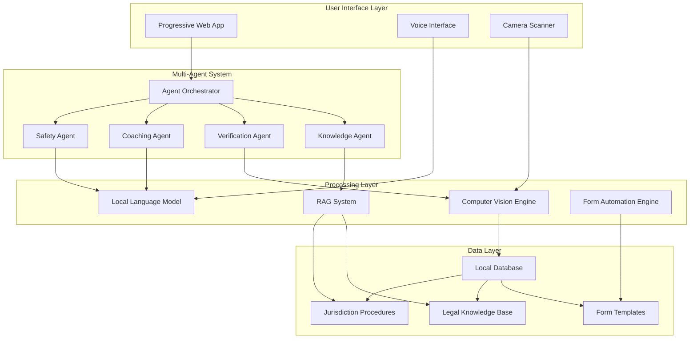
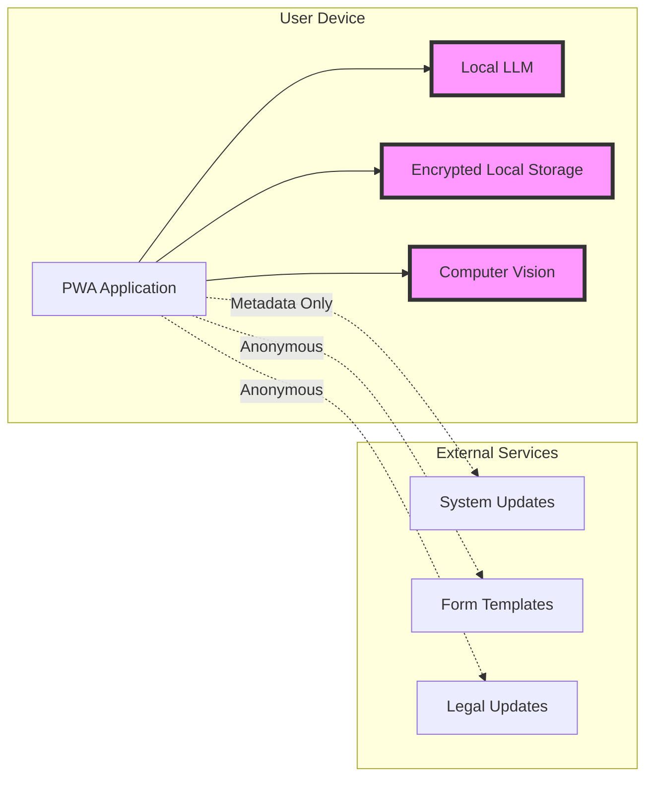
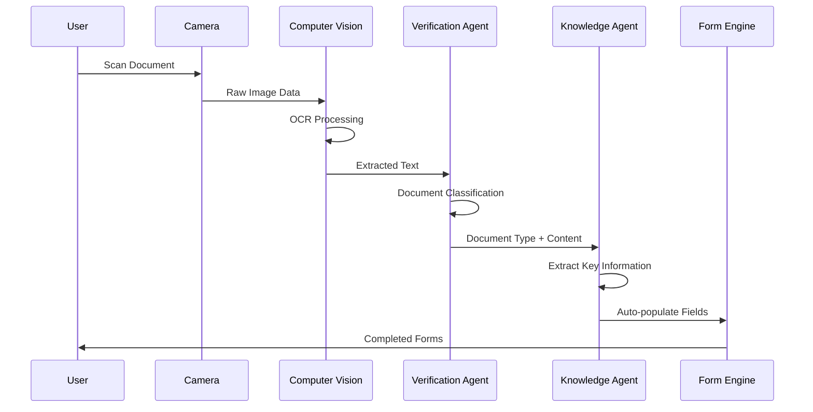
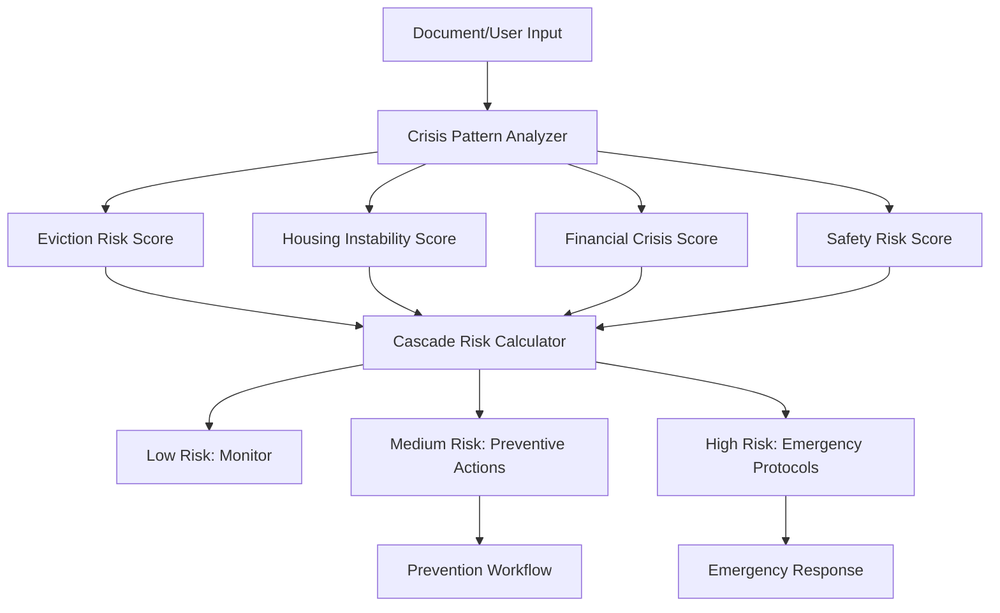

# Design Document: The Last Mile Justice Navigator

## Overview

The Last Mile Justice Navigator is a sophisticated multi-agent system designed to help individuals navigate cascading crises through coordinated AI assistance. The system combines computer vision document processing, offline-first architecture, and trauma-informed design to provide comprehensive crisis management while maintaining strict privacy and security standards.

The core innovation lies in the multi-agent coordination system that recognizes patterns of cascading failures and activates parallel workflows across legal, housing, financial, and safety domains. By processing documents locally and maintaining zero-knowledge architecture, the system ensures user privacy while providing expert-level guidance through specialized AI agents.

## Architecture

### High-Level System Architecture



### Multi-Agent System Design

The system employs four specialized agents coordinated by a central orchestrator:

**Agent Orchestrator**: Routes user inputs to appropriate agents, manages inter-agent communication, and ensures coherent responses. Implements crisis cascade detection algorithms and coordinates parallel workflows.

**Knowledge Agent**: Maintains jurisdiction-specific legal procedures, deadlines, and requirements. Uses RAG system to provide accurate, location-aware guidance while preventing hallucinations through constraint-based generation.

**Verification Agent**: Processes documents through computer vision, validates completeness, and cross-references extracted information against known templates and requirements.

**Coaching Agent**: Provides trauma-informed guidance, emotional support, and step-by-step assistance. Implements decision-support frameworks that reduce cognitive load during crisis situations.

**Safety Agent**: Specialized for domestic violence and safety scenarios. Implements additional privacy protections, safety planning, and crisis intervention protocols.

### Privacy and Security Architecture

The system implements a zero-knowledge architecture where sensitive data never leaves the user's device:



All personal data, documents, and AI processing occur locally. Only anonymous metadata and system updates are transmitted externally.

## Components and Interfaces

### Document Processing Pipeline

The document processing system handles various legal and administrative documents:



**Computer Vision Engine**: Processes document images using local OCR capabilities. Supports various document types including eviction notices, benefits letters, court documents, and government forms.

**Document Classifier**: Identifies document types and extracts structured information. Maintains templates for common legal and administrative documents across different jurisdictions.

**Form Automation Engine**: Maps extracted information to appropriate government forms and applications. Handles jurisdiction-specific variations and form version updates.

### Crisis Cascade Detection System

The system implements pattern recognition to identify cascading failure risks:



**Risk Scoring Algorithm**: Analyzes multiple factors including financial indicators, legal deadlines, housing status, and safety concerns to calculate cascade probability.

**Prevention Workflow Engine**: Activates appropriate interventions based on risk scores, including application assistance, deadline management, and resource connections.

### Agent Communication Protocol

Agents communicate through a structured message passing system:

```typescript
interface AgentMessage {
  id: string;
  from: AgentType;
  to: AgentType[];
  type: MessageType;
  payload: any;
  priority: Priority;
  timestamp: Date;
}

interface CrisisContext {
  userId: string;
  crisisType: CrisisType[];
  riskScore: number;
  activeDeadlines: Deadline[];
  documents: ProcessedDocument[];
  safetyFlags: SafetyFlag[];
}
```

**Message Types**: Include information requests, task assignments, status updates, and emergency alerts. Priority system ensures safety-critical messages are processed immediately.

**Context Sharing**: Agents maintain shared crisis context while respecting privacy boundaries. Safety agent can restrict information sharing when domestic violence indicators are present.

## Data Models

### Core Data Structures

```typescript
interface User {
  id: string;
  preferences: UserPreferences;
  accessibilityNeeds: AccessibilitySettings;
  privacyLevel: PrivacyLevel;
  activeCase: CaseContext;
}

interface CaseContext {
  id: string;
  crisisTypes: CrisisType[];
  timeline: Timeline;
  documents: Document[];
  forms: FormApplication[];
  riskAssessment: RiskAssessment;
  interventions: Intervention[];
}

interface Document {
  id: string;
  type: DocumentType;
  extractedData: ExtractedData;
  verificationStatus: VerificationStatus;
  expirationDate?: Date;
  criticalDeadlines: Deadline[];
}

interface Timeline {
  id: string;
  milestones: Milestone[];
  deadlines: Deadline[];
  completedTasks: Task[];
  upcomingTasks: Task[];
}

interface RiskAssessment {
  overallScore: number;
  categoryScores: CategoryScore[];
  cascadeRisk: CascadeRisk;
  recommendedActions: Action[];
  lastUpdated: Date;
}
```

### Document Templates and Forms

The system maintains templates for common legal documents and government forms:

```typescript
interface DocumentTemplate {
  id: string;
  jurisdiction: string;
  documentType: DocumentType;
  requiredFields: Field[];
  optionalFields: Field[];
  extractionRules: ExtractionRule[];
  validationRules: ValidationRule[];
}

interface FormTemplate {
  id: string;
  agency: string;
  formNumber: string;
  version: string;
  fields: FormField[];
  dependencies: FormDependency[];
  submissionRules: SubmissionRule[];
}
```

### Privacy and Encryption Models

All sensitive data is encrypted using device-specific keys:

```typescript
interface EncryptedData {
  id: string;
  encryptedContent: string;
  encryptionMethod: EncryptionMethod;
  keyDerivation: KeyDerivationInfo;
  accessLevel: AccessLevel;
}

interface PrivacySettings {
  dataRetention: RetentionPolicy;
  sharingPermissions: SharingPermission[];
  auditLog: AuditEntry[];
  emergencyAccess: EmergencyAccessConfig;
}
```

## Correctness Properties

*A property is a characteristic or behavior that should hold true across all valid executions of a system—essentially, a formal statement about what the system should do. Properties serve as the bridge between human-readable specifications and machine-verifiable correctness guarantees.*

Before defining the correctness properties, I need to analyze the acceptance criteria from the requirements to determine which are testable as properties, examples, or edge cases.

### Property Reflection

After analyzing all acceptance criteria, I identified several areas where properties can be consolidated to eliminate redundancy:

**Document Processing Properties**: Properties 2.1-2.5 all relate to document processing and can be streamlined to focus on core functionality rather than specific document types.

**Agent Coordination Properties**: Properties 3.1-3.5 can be consolidated into comprehensive agent behavior properties rather than individual agent responses.

**Privacy Properties**: Properties 4.1-4.5 all relate to data privacy and can be combined into comprehensive privacy protection properties.

**Offline Functionality**: Properties 5.1-5.5 can be consolidated into comprehensive offline operation properties.

**Legal Guidance Properties**: Properties 6.1-6.5 can be combined into constraint-based legal guidance properties.

**Form Automation Properties**: Properties 7.1-7.5 can be streamlined into comprehensive form handling properties.

**Timeline Management Properties**: Properties 8.1-8.5 can be consolidated into comprehensive deadline management properties.

Based on this reflection, I'll create consolidated properties that provide unique validation value without redundancy.

### Crisis Detection Properties

**Property 1: Crisis cascade pattern recognition**
*For any* document input containing crisis indicators, the system should identify all related cascade risks within the specified time limit and activate appropriate parallel workflows.
**Validates: Requirements 1.1, 1.2, 1.3, 1.4, 1.5**

**Property 2: Risk escalation prevention**
*For any* combination of risk factors, the system should calculate accurate cascade probability scores and suggest preventive actions prioritized by impact when high-risk patterns are detected.
**Validates: Requirements 11.1, 11.2, 11.3, 11.4, 11.5**

### Document Processing Properties

**Property 3: Document processing round-trip accuracy**
*For any* scanned document, the system should extract key information with specified accuracy, classify the document type correctly, and auto-populate relevant forms while maintaining offline functionality.
**Validates: Requirements 2.1, 2.2, 2.3, 2.4, 2.5**

**Property 4: Form automation completeness**
*For any* user information collected, the system should populate all relevant application forms across jurisdictions, handle form version updates, generate required document checklists, and validate completeness before submission.
**Validates: Requirements 7.1, 7.2, 7.3, 7.4, 7.5**

### Multi-Agent Coordination Properties

**Property 5: Agent response consistency**
*For any* user scenario requiring multi-agent assistance, all agents should provide coordinated responses without conflicts, with each agent operating within their specialized domain while maintaining shared context.
**Validates: Requirements 3.1, 3.2, 3.3, 3.4, 3.5**

**Property 6: Human oversight for critical decisions**
*For any* decision with permanent consequences, immediate danger, or exceeding defined thresholds, the system should require appropriate human consultation and clearly distinguish between AI suggestions and human-verified advice.
**Validates: Requirements 12.1, 12.2, 12.3, 12.4, 12.5**

### Privacy and Security Properties

**Property 7: Zero-knowledge data protection**
*For any* sensitive data processing, the system should keep all information on the user's device, operate AI processing locally, prevent external data transmission, provide additional encryption for safety protocols, and allow complete data deletion.
**Validates: Requirements 4.1, 4.2, 4.3, 4.4, 4.5**

**Property 8: Offline-first functionality preservation**
*For any* system operation, full functionality should be maintained without internet connectivity, AI assistance should work offline, only non-sensitive metadata should sync when reconnecting, and offline work should be properly queued.
**Validates: Requirements 5.1, 5.2, 5.3, 5.4, 5.5**

### Legal Guidance Properties

**Property 9: Constraint-based legal accuracy**
*For any* legal guidance request, the system should only use verified jurisdiction-specific rules, clearly state limitations when uncertain, use only pre-approved templates for document generation, cross-reference authoritative sources for deadlines, and update procedures only from verified government sources.
**Validates: Requirements 6.1, 6.2, 6.3, 6.4, 6.5**

### Timeline and Accessibility Properties

**Property 10: Comprehensive deadline management**
*For any* deadline extracted from documents, the system should create personalized timelines with buffers, send reminders at specified intervals, prioritize conflicting deadlines by legal consequences, update timelines when tasks complete, and account for weekends and holidays.
**Validates: Requirements 8.1, 8.2, 8.3, 8.4, 8.5**

**Property 11: Trauma-informed interface consistency**
*For any* user interaction, the system should use clear non-judgmental language, limit choices to prevent paralysis, provide supportive error messaging, offer content warnings for sensitive topics, and show progress indicators.
**Validates: Requirements 9.1, 9.2, 9.3, 9.4, 9.5**

**Property 12: Universal accessibility support**
*For any* user interaction method, the system should support voice input with specified accuracy, offer text-to-speech conversion, provide keyboard and screen reader access, accept voice input for forms, and support multiple languages.
**Validates: Requirements 10.1, 10.2, 10.3, 10.4, 10.5**

## Error Handling

The system implements comprehensive error handling across all components:

### Document Processing Errors
- **OCR Failures**: When document scanning fails, the system provides manual input options and suggests document quality improvements
- **Classification Errors**: When document type cannot be determined, the system requests user confirmation and learns from corrections
- **Extraction Errors**: When key information cannot be extracted, the system highlights missing fields and requests manual verification

### Agent Communication Errors
- **Agent Unavailability**: When an agent cannot respond, the orchestrator routes requests to backup capabilities or queues for retry
- **Conflicting Responses**: When agents provide conflicting advice, the orchestrator flags conflicts and requests human oversight
- **Context Loss**: When agent context is corrupted, the system rebuilds context from available data and notifies the user of potential gaps

### Privacy and Security Errors
- **Encryption Failures**: When encryption fails, the system prevents data storage and alerts the user to security risks
- **Data Breach Detection**: When unauthorized access is detected, the system immediately locks down and provides user notification
- **Network Exposure**: When data transmission is attempted inappropriately, the system blocks transmission and logs the attempt

### System Recovery Procedures
- **Graceful Degradation**: When components fail, the system continues operating with reduced functionality rather than complete failure
- **Data Recovery**: When local data is corrupted, the system attempts recovery from backup copies and provides data export options
- **Emergency Protocols**: When safety-critical errors occur, the system immediately connects users to human crisis support

## Testing Strategy

The testing approach combines comprehensive unit testing with property-based testing to ensure system reliability and correctness.

### Property-Based Testing Configuration

The system will use **Hypothesis** (Python) for property-based testing, configured with:
- **Minimum 100 iterations** per property test to ensure comprehensive input coverage
- **Custom generators** for legal documents, crisis scenarios, and user interactions
- **Shrinking strategies** to identify minimal failing cases for debugging
- **Deterministic seeding** for reproducible test runs

Each property test will be tagged with comments referencing the design document:
```python
# Feature: last-mile-justice-navigator, Property 1: Crisis cascade pattern recognition
# Feature: last-mile-justice-navigator, Property 3: Document processing round-trip accuracy
```

### Unit Testing Strategy

Unit tests will focus on:
- **Specific examples** of successful crisis detection and intervention
- **Edge cases** such as corrupted documents, network failures, and boundary conditions
- **Integration points** between agents and system components
- **Error conditions** and recovery procedures
- **Accessibility features** and trauma-informed design elements

### Testing Data and Scenarios

**Synthetic Legal Documents**: Generate realistic eviction notices, benefits denials, court documents, and government forms across multiple jurisdictions for testing document processing accuracy.

**Crisis Scenario Simulations**: Create comprehensive test scenarios covering all three core crisis types (eviction cascades, disability benefit denials, domestic violence situations) with varying complexity levels.

**Multi-Agent Interaction Tests**: Verify agent coordination through complex scenarios requiring multiple agents to collaborate while maintaining consistency and avoiding conflicts.

**Privacy and Security Validation**: Test zero-knowledge architecture through network monitoring, data flow analysis, and encryption verification across all system operations.

**Accessibility and Trauma-Informed Testing**: Validate interface design through simulated user interactions with various accessibility needs and stress levels.

### Continuous Testing and Monitoring

**Automated Test Execution**: All property tests and unit tests run automatically on code changes with immediate feedback on failures.

**Performance Monitoring**: Continuous monitoring of response times, especially for the 30-second crisis detection requirement and offline functionality.

**Privacy Auditing**: Regular automated audits of data flows to ensure no sensitive information leaves the user's device.

**User Experience Testing**: Ongoing validation of trauma-informed design principles through simulated user interactions and accessibility compliance checks.

The dual testing approach ensures both specific functionality (unit tests) and universal correctness (property tests) while maintaining the high reliability standards required for crisis management systems.