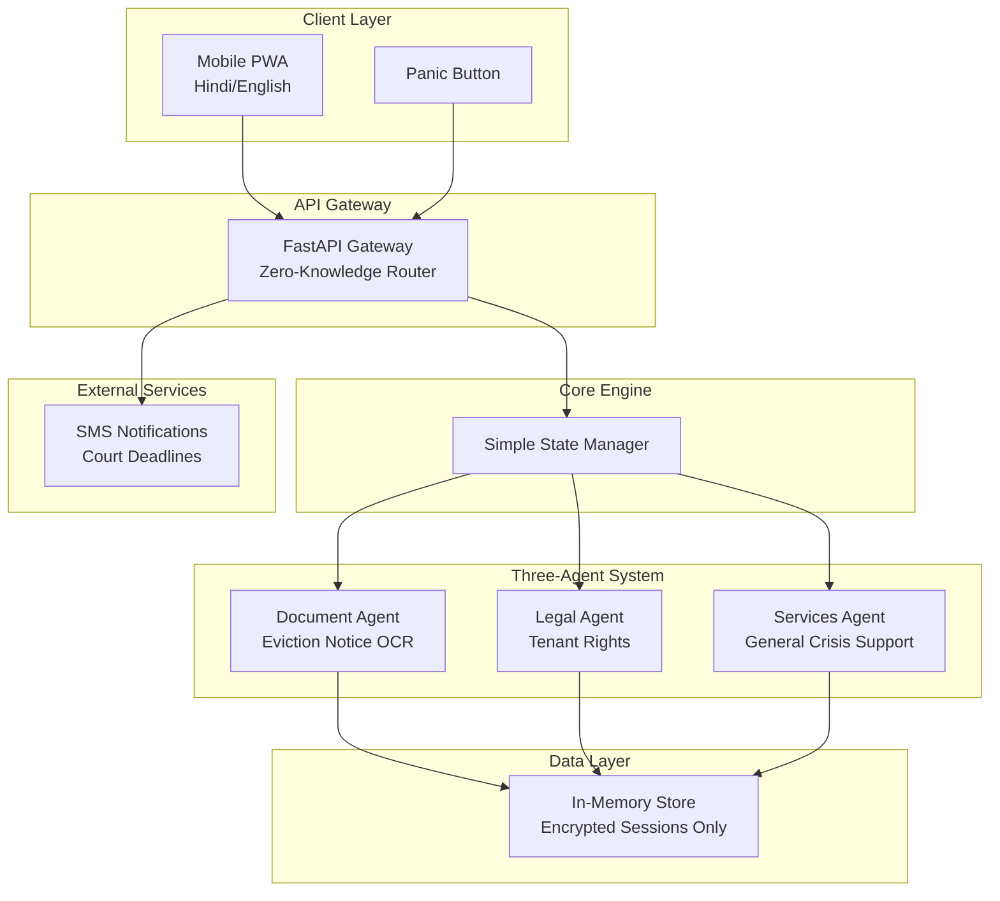
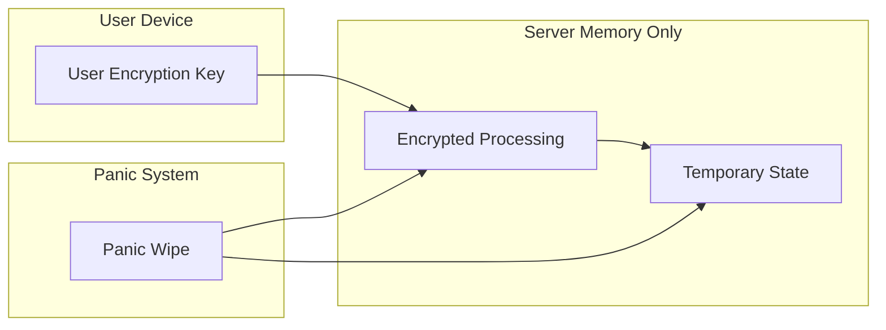

# Design Document: Last Mile Justice Navigator (30-Day MVP)

## Overview

The Last Mile Justice Navigator MVP is a simplified, focused system designed to address the single most critical crisis in India: **eviction notices**. This 30-day buildable version uses a two-agent architecture that processes eviction documents and provides legal guidance while maintaining zero-knowledge privacy.

The MVP focuses on the P0 (Critical) requirements and one high-impact crisis scenario to deliver immediate value to vulnerable populations facing eviction.

## Architecture

### Simplified System Architecture



### Zero-Knowledge Privacy Architecture (Simplified)



## Components and Interfaces

### 1. Document Agent (Eviction-Focused)

**Purpose**: OCR processing specifically for Indian eviction notices

**Simplified Capabilities**:
- Eviction notice OCR (Hindi/English)
- Deadline extraction (court dates, notice periods)
- Landlord/tenant detail extraction
- Basic document validation

**Interface**:
```python
class DocumentAgent:
    def extract_eviction_data(self, image: bytes) -> EvictionData
    def extract_court_deadlines(self, text: str) -> List[Deadline]
    def validate_eviction_notice(self, data: EvictionData) -> bool
```

### 2. Legal Agent (Tenant Rights Only)

**Purpose**: Basic tenant rights guidance for eviction cases

**Simplified Capabilities**:
- Basic tenant rights information
- Court response templates
- Deadline calculations
- Legal aid contact information

**Interface**:
```python
class LegalAgent:
    def get_tenant_rights(self, state: str) -> TenantRights
    def generate_court_response(self, eviction_data: EvictionData) -> ResponseTemplate
    def calculate_response_deadline(self, notice_date: date, state: str) -> date
    def get_legal_aid_contacts(self, district: str) -> List[Contact]
```

### 3. Services Agent (General Crisis Support)

**Purpose**: General crisis support and resource connection

**Simplified Capabilities**:
- Crisis hotline information
- Basic government scheme awareness
- Emergency shelter contacts
- Legal aid directory
- General crisis guidance

**Interface**:
```python
class ServicesAgent:
    def get_crisis_hotlines(self, crisis_type: str, state: str) -> List[Contact]
    def find_emergency_shelter(self, location: str) -> List[ShelterContact]
    def get_basic_scheme_info(self, crisis_type: str) -> List[SchemeInfo]
    def find_legal_aid(self, district: str) -> List[LegalAidContact]
    def provide_general_guidance(self, crisis_type: str) -> GuidanceText
```

**Crisis Support Coverage**:
- Emergency contacts (police, women's helpline, suicide prevention)
- Basic housing assistance information
- Food security resources
- Healthcare emergency contacts
- General legal aid contacts

### 4. Simple State Manager

**Purpose**: Basic workflow coordination for three agents

**Simplified Capabilities**:
- Document → Legal → Services workflow
- General crisis query handling
- Deadline tracking
- Basic notification scheduling

```python
class SimpleStateManager:
    def process_eviction_case(self, document_data: EvictionData) -> CaseGuidance
    def handle_general_crisis_query(self, query: str, crisis_type: str) -> CrisisResponse
    def schedule_deadline_reminders(self, deadlines: List[Deadline]) -> None
    def get_next_actions(self, case_state: CaseState) -> List[Action]
```

## Data Models

### Simplified Data Structures (MVP)

```python
@dataclass
class EvictionData:
    notice_date: date
    court_date: Optional[date]
    landlord_name: str  # Extracted, not stored persistently
    property_address: str  # Extracted, not stored persistently
    eviction_reason: str
    notice_period_days: int
    confidence_score: float

@dataclass
class TenantRights:
    state: str
    notice_period_required: int
    valid_eviction_grounds: List[str]
    tenant_defenses: List[str]
    legal_aid_contacts: List[Contact]

@dataclass
class CrisisResponse:
    crisis_type: str
    emergency_contacts: List[Contact]
    basic_guidance: str
    relevant_schemes: List[str]
    next_steps: List[str]

@dataclass
class CaseGuidance:
    next_actions: List[str]
    deadlines: List[Deadline]
    response_template: str
    legal_aid_contacts: List[Contact]
    emergency_resources: List[Contact]
    urgency_level: UrgencyLevel

@dataclass
class AnonymizedSession:
    session_id: str  # Hash-based
    state: str  # For legal context
    case_type: str  # "eviction" or "general_crisis"
    deadlines: List[Deadline]
    # No personal information stored
```

### Privacy-First Data Design (Simplified)

```python
@dataclass
class EncryptedSession:
    session_id: str
    encrypted_data: bytes  # All PII encrypted with user key
    expiry_timestamp: datetime
    panic_wipe_enabled: bool = True
```

## Correctness Properties (Simplified MVP)

*A property is a characteristic or behavior that should hold true across all valid executions of a system—essentially, a formal statement about what the system should do. Properties serve as the bridge between human-readable specifications and machine-verifiable correctness guarantees.*

### Property 1: Zero-Knowledge Privacy Enforcement
*For any* user session processing eviction data, all personally identifiable information should be handled in encrypted memory only, with complete data purging upon session end or panic button activation within 5 seconds, and no PII should ever be stored persistently.
**Validates: Requirements 1.1, 1.2, 1.3, 1.4, 1.5**

### Property 2: Eviction Document Processing
*For any* valid Indian eviction notice uploaded to the system, the Document_Agent should extract key information (notice date, court date, eviction reason, notice period) and present results for user verification before proceeding.
**Validates: Requirements 2.1, 2.2, 2.3, 2.4, 2.5**

### Property 3: Legal Guidance Safety
*For any* legal guidance provided about tenant rights, the system should clearly distinguish between factual information and general guidance, flag low-confidence responses, and redirect complex cases to legal aid resources.
**Validates: Requirements 3.1, 3.2, 3.3, 3.4, 3.5**

### Property 4: Eviction Response Workflow
*For any* processed eviction notice, the system should provide appropriate tenant rights information, generate response guidance, calculate correct deadlines with Indian holiday adjustments, and provide legal aid contacts.
**Validates: Requirements 4.1, 5.1, 5.2, 5.3, 6.1**

### Property 5: General Crisis Support
*For any* general crisis query, the Services_Agent should provide appropriate emergency contacts, basic guidance, relevant scheme information, and next steps based on the crisis type and user's state.
**Validates: Requirements 8.1, 8.2, 8.3, 8.4, 8.5**

## Error Handling (Simplified)

### Privacy-First Error Handling

**Data Breach Prevention**:
- All error logs scrubbed of PII
- System failures trigger automatic data purging
- No sensitive information in error responses

**Graceful Degradation**:
- Offline mode for basic document processing
- Cached tenant rights information when connectivity fails
- Manual verification prompts for unclear OCR results

### Eviction-Specific Error Handling

**Document Processing Errors**:
- Fallback to English when Hindi OCR fails
- Manual verification for poor-quality images
- Clear error messages for unsupported document types

**Legal Information Errors**:
- Clear boundaries on system capabilities
- Automatic escalation to legal aid for complex cases
- Risk warnings for self-representation

## Testing Strategy (Simplified)

### Dual Testing Approach

**Unit Tests**: Focus on specific eviction scenarios and edge cases
- Sample eviction notice parsing
- Tenant rights lookup for different states
- Deadline calculation with Indian holidays
- Privacy data handling edge cases

**Property Tests**: Verify universal properties with minimum 100 iterations per test
- Document processing across eviction notice variations
- Privacy enforcement across all data operations
- Legal guidance consistency across different cases
- Workflow completeness across different eviction scenarios

### Property-Based Testing Configuration

**Testing Framework**: Use Hypothesis (Python) for property-based testing
**Minimum Iterations**: 100 per property test
**Test Tagging**: Each property test must reference its design document property

**Example Test Tags**:
- **Feature: last-mile-justice-navigator, Property 1: Zero-Knowledge Privacy Enforcement**
- **Feature: last-mile-justice-navigator, Property 2: Eviction Document Processing**
- **Feature: last-mile-justice-navigator, Property 3: Legal Guidance Safety**
- **Feature: last-mile-justice-navigator, Property 4: Eviction Response Workflow**

### MVP Testing Focus

**Critical Path Testing**:
- Eviction notice upload → OCR → Legal guidance → Response template
- Privacy enforcement throughout the entire workflow
- Panic button functionality and data wiping
- Basic Hindi/English document processing

## Implementation Notes (30-Day MVP)

### Simplified Technology Stack

**Frontend**: Next.js PWA (basic offline capability)
**Backend**: Python FastAPI (simple REST API)
**OCR**: Tesseract with Hindi support (no cloud dependencies initially)
**Database**: Redis for session storage only (no persistent data)
**Notifications**: Basic SMS integration (Twilio or similar)

### MVP Scope Limitations

**What's Included**:
- Eviction notice processing (primary focus)
- General crisis support queries
- Basic tenant rights information
- Emergency contact directory
- Simple response templates
- Deadline calculations
- Privacy protection and panic button

**What's Excluded (Future Versions)**:
- Complex government scheme applications
- Advanced multi-crisis coordination
- Sophisticated AI safety features
- Comprehensive legal database integration
- Document generation for multiple crisis types

### 30-Day Development Phases

**Week 1**: Core privacy architecture and document processing
**Week 2**: Legal agent with tenant rights + Services agent with crisis support
**Week 3**: Frontend PWA and three-agent workflow integration
**Week 4**: Testing, refinement, and deployment

### Data Curation (Minimal Viable Dataset)

**Required Data**:
- Sample eviction notices (10-15 per major state)
- Basic tenant rights by state (simplified)
- Court holiday calendars (major states)
- Legal aid contact information
- Crisis hotline directory (state-wise)
- Emergency shelter contacts (major cities)
- Basic government scheme information (awareness level)

**Data Sources**:
- Public legal aid websites
- Court websites for holiday schedules
- Anonymized sample documents from legal aid organizations

This simplified design focuses on delivering immediate value for the most critical crisis (eviction) while maintaining the core privacy and safety principles. The system can be built in 30 days and expanded later with additional crisis types and more sophisticated features.